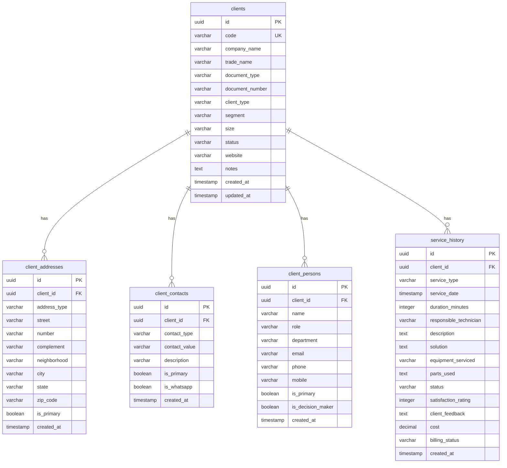

# 📚 Documentação Técnica - StarPrint CRM

## 🏗️ Arquitetura do Sistema

### Visão Geral da Arquitetura

O StarPrint CRM segue uma arquitetura **SPA (Single Page Application)** com backend as a service, utilizando React no frontend e Supabase como backend completo.

```
┌─────────────────┐    ┌─────────────────┐    ┌─────────────────┐
│   Frontend      │    │   Supabase      │    │   External      │
│   (React)       │◄──►│   (Backend)     │◄──►│   Services      │
└─────────────────┘    └─────────────────┘    └─────────────────┘
        │                       │                       │
        │                       │                       │
        ▼                       ▼                       ▼
┌─────────────────┐    ┌─────────────────┐    ┌─────────────────┐
│   UI Components │    │   PostgreSQL    │    │   APIs          │
│   State Mgmt    │    │   Auth          │    │   Webhooks      │
│   Routing       │    │   Real-time     │    │   Integrations  │
└─────────────────┘    └─────────────────┘    └─────────────────┘
```

### Stack Tecnológica Detalhada

#### Frontend
- **React 18.3.1**: Biblioteca principal com hooks e context
- **TypeScript 5.5.3**: Tipagem estática para melhor DX
- **Vite 5.4.1**: Build tool e dev server ultra-rápido
- **React Router DOM 6.26.2**: Roteamento client-side
- **React Hook Form 7.53.0**: Gerenciamento de formulários
- **Zod 3.23.8**: Validação de schemas

#### UI/UX
- **Tailwind CSS 3.4.11**: Framework CSS utility-first
- **Shadcn/ui**: Componentes React reutilizáveis
- **Lucide React 0.462.0**: Ícones modernos
- **Sonner 1.5.0**: Sistema de notificações toast
- **Recharts 2.12.7**: Gráficos e visualizações

#### Backend (Supabase)
- **PostgreSQL**: Banco de dados relacional
- **Row Level Security (RLS)**: Segurança em nível de linha
- **Real-time Subscriptions**: Atualizações em tempo real
- **Authentication**: Sistema de autenticação completo
- **Storage**: Armazenamento de arquivos

#### Ferramentas de Desenvolvimento
- **ESLint 9.9.0**: Linting de código
- **Prettier**: Formatação automática
- **Husky**: Git hooks
- **Vitest**: Framework de testes

## 📁 Estrutura de Diretórios

```
src/
├── components/                 # Componentes React
│   ├── ui/                    # Componentes base (Shadcn/ui)
│   │   ├── button.tsx         # Botões reutilizáveis
│   │   ├── card.tsx           # Cards e containers
│   │   ├── dialog.tsx         # Modais e overlays
│   │   ├── form.tsx           # Componentes de formulário
│   │   └── ...                # Outros componentes UI
│   ├── clients/               # Módulo de Gestão de Clientes
│   │   ├── ClientsManagement.tsx      # Painel principal
│   │   ├── AddClientModal.tsx         # Modal de cadastro
│   │   ├── EditClientModal.tsx        # Modal de edição
│   │   ├── ClientAnalytics.tsx        # Analytics avançado
│   │   ├── QuickInsights.tsx          # Insights rápidos
│   │   └── ClientRegistrationSummary.tsx # Resumo do cadastro
│   ├── atendimento/           # Módulo de Atendimento
│   │   ├── AtendimentoChat.tsx        # Chat de atendimento
│   │   ├── DashboardAtendimento.tsx   # Dashboard do módulo
│   │   ├── FilaAtendimento.tsx        # Gestão de fila
│   │   └── ...                # Outros componentes
│   ├── dashboard/             # Dashboards e Analytics
│   │   ├── EnhancedDashboard.tsx      # Dashboard principal
│   │   ├── NPSCard.tsx                # Card de NPS
│   │   └── ...                # Outros dashboards
│   ├── layouts/               # Componentes de Layout
│   │   ├── AppLayout.tsx              # Layout principal
│   │   ├── AppHeader.tsx              # Header da aplicação
│   │   ├── DesktopSidebar.tsx         # Sidebar desktop
│   │   ├── MobileSidebar.tsx          # Sidebar mobile
│   │   └── ...                # Outros layouts
│   └── shared/                # Componentes compartilhados
│       ├── SectionHeader.tsx          # Headers de seção
│       ├── StatCard.tsx               # Cards de estatísticas
│       └── ...                # Outros componentes
├── config/                    # Configurações
│   └── navigation.ts          # Configuração de navegação
├── contexts/                  # Contextos React
│   └── AuthContext.tsx        # Contexto de autenticação
├── hooks/                     # Hooks customizados
│   ├── use-mobile.tsx         # Hook para detecção mobile
│   ├── use-toast.ts           # Hook para notificações
│   ├── useAppDetection.ts     # Hook para detecção de app
│   └── ...                    # Outros hooks
├── integrations/              # Integrações externas
│   └── supabase/              # Integração com Supabase
│       ├── client.ts          # Cliente Supabase
│       └── types.ts           # Tipos do Supabase
├── lib/                       # Utilitários
│   └── utils.ts               # Funções utilitárias
├── types/                     # Definições de tipos
│   ├── auth.ts                # Tipos de autenticação
│   └── navigation.ts          # Tipos de navegação
├── utils/                     # Funções utilitárias
│   ├── performance.ts         # Utilitários de performance
│   └── validation.ts          # Validações
├── App.tsx                    # Componente raiz
├── main.tsx                   # Ponto de entrada
└── index.css                  # Estilos globais
```

## 🗄️ Modelo de Dados

### Tabelas Principais

#### `clients` - Clientes
```sql
CREATE TABLE clients (
  id UUID PRIMARY KEY DEFAULT gen_random_uuid(),
  code VARCHAR(50) UNIQUE NOT NULL,
  company_name VARCHAR(255) NOT NULL,
  trade_name VARCHAR(255),
  document_type VARCHAR(10) NOT NULL,
  document_number VARCHAR(20) NOT NULL,
  client_type VARCHAR(20) NOT NULL DEFAULT 'regular',
  segment VARCHAR(100),
  size VARCHAR(20),
  status VARCHAR(20) NOT NULL DEFAULT 'active',
  website VARCHAR(255),
  notes TEXT,
  created_at TIMESTAMP WITH TIME ZONE DEFAULT NOW(),
  updated_at TIMESTAMP WITH TIME ZONE DEFAULT NOW()
);
```

#### `client_addresses` - Endereços dos Clientes
```sql
CREATE TABLE client_addresses (
  id UUID PRIMARY KEY DEFAULT gen_random_uuid(),
  client_id UUID REFERENCES clients(id) ON DELETE CASCADE,
  address_type VARCHAR(20) NOT NULL,
  street VARCHAR(255) NOT NULL,
  number VARCHAR(20) NOT NULL,
  complement VARCHAR(255),
  neighborhood VARCHAR(100) NOT NULL,
  city VARCHAR(100) NOT NULL,
  state VARCHAR(2) NOT NULL,
  zip_code VARCHAR(10) NOT NULL,
  is_primary BOOLEAN DEFAULT FALSE,
  created_at TIMESTAMP WITH TIME ZONE DEFAULT NOW()
);
```

#### `client_contacts` - Contatos dos Clientes
```sql
CREATE TABLE client_contacts (
  id UUID PRIMARY KEY DEFAULT gen_random_uuid(),
  client_id UUID REFERENCES clients(id) ON DELETE CASCADE,
  contact_type VARCHAR(20) NOT NULL,
  contact_value VARCHAR(255) NOT NULL,
  description VARCHAR(255),
  is_primary BOOLEAN DEFAULT FALSE,
  is_whatsapp BOOLEAN DEFAULT FALSE,
  created_at TIMESTAMP WITH TIME ZONE DEFAULT NOW()
);
```

#### `client_persons` - Pessoas de Contato
```sql
CREATE TABLE client_persons (
  id UUID PRIMARY KEY DEFAULT gen_random_uuid(),
  client_id UUID REFERENCES clients(id) ON DELETE CASCADE,
  name VARCHAR(255) NOT NULL,
  role VARCHAR(100),
  department VARCHAR(100),
  email VARCHAR(255),
  phone VARCHAR(20),
  mobile VARCHAR(20),
  is_primary BOOLEAN DEFAULT FALSE,
  is_decision_maker BOOLEAN DEFAULT FALSE,
  created_at TIMESTAMP WITH TIME ZONE DEFAULT NOW()
);
```

#### `service_history` - Histórico de Serviços
```sql
CREATE TABLE service_history (
  id UUID PRIMARY KEY DEFAULT gen_random_uuid(),
  client_id UUID REFERENCES clients(id) ON DELETE CASCADE,
  service_type VARCHAR(50) NOT NULL,
  service_date TIMESTAMP WITH TIME ZONE NOT NULL,
  duration_minutes INTEGER,
  responsible_technician VARCHAR(255) NOT NULL,
  description TEXT NOT NULL,
  solution TEXT,
  equipment_serviced VARCHAR(255),
  parts_used TEXT,
  status VARCHAR(20) NOT NULL DEFAULT 'completed',
  satisfaction_rating INTEGER CHECK (satisfaction_rating >= 1 AND satisfaction_rating <= 5),
  client_feedback TEXT,
  cost DECIMAL(10,2),
  billing_status VARCHAR(20) DEFAULT 'pending',
  created_at TIMESTAMP WITH TIME ZONE DEFAULT NOW()
);
```

### Relacionamentos



## 🔧 Padrões de Desenvolvimento

### Convenções de Nomenclatura

#### Arquivos e Diretórios
- **PascalCase**: Componentes React (`ClientManagement.tsx`)
- **camelCase**: Hooks e utilitários (`useClientData.ts`)
- **kebab-case**: Arquivos CSS e configuração (`tailwind.config.ts`)
- **snake_case**: Migrações SQL (`20250120000000_insert_main_clients.sql`)

#### Variáveis e Funções
- **camelCase**: Variáveis e funções (`clientData`, `fetchClients`)
- **PascalCase**: Componentes e tipos (`ClientData`, `ClientInterface`)
- **UPPER_SNAKE_CASE**: Constantes (`API_BASE_URL`, `MAX_RETRY_ATTEMPTS`)

#### CSS Classes
- **kebab-case**: Classes customizadas (`client-card`, `status-active`)
- **Tailwind**: Classes utilitárias (`bg-primary`, `text-center`)

### Estrutura de Componentes

```typescript
// 1. Imports
import React, { useState, useEffect } from 'react';
import { Card, CardContent, CardHeader, CardTitle } from '@/components/ui/card';
import { Button } from '@/components/ui/button';

// 2. Interfaces/Types
interface ComponentProps {
  title: string;
  onAction: () => void;
}

// 3. Componente Principal
const ComponentName: React.FC<ComponentProps> = ({ title, onAction }) => {
  // 4. Estados
  const [loading, setLoading] = useState(false);
  const [data, setData] = useState<DataType[]>([]);

  // 5. Effects
  useEffect(() => {
    fetchData();
  }, []);

  // 6. Funções
  const fetchData = async () => {
    setLoading(true);
    try {
      // Lógica de fetch
    } catch (error) {
      console.error('Erro:', error);
    } finally {
      setLoading(false);
    }
  };

  // 7. Render
  return (
    <Card>
      <CardHeader>
        <CardTitle>{title}</CardTitle>
      </CardHeader>
      <CardContent>
        {/* Conteúdo */}
      </CardContent>
    </Card>
  );
};

// 8. Export
export default ComponentName;
```

### Gerenciamento de Estado

#### Context API
```typescript
// contexts/AuthContext.tsx
interface AuthContextType {
  user: User | null;
  login: (credentials: LoginCredentials) => Promise<void>;
  logout: () => void;
}

const AuthContext = createContext<AuthContextType | undefined>(undefined);

export const AuthProvider: React.FC<{ children: React.ReactNode }> = ({ children }) => {
  const [user, setUser] = useState<User | null>(null);

  const login = async (credentials: LoginCredentials) => {
    // Lógica de login
  };

  const logout = () => {
    // Lógica de logout
  };

  return (
    <AuthContext.Provider value={{ user, login, logout }}>
      {children}
    </AuthContext.Provider>
  );
};
```

#### Custom Hooks
```typescript
// hooks/useClientData.ts
export const useClientData = () => {
  const [clients, setClients] = useState<Client[]>([]);
  const [loading, setLoading] = useState(true);

  const fetchClients = useCallback(async () => {
    setLoading(true);
    try {
      const { data, error } = await supabase
        .from('clients')
        .select('*');
      
      if (error) throw error;
      setClients(data || []);
    } catch (error) {
      console.error('Erro ao carregar clientes:', error);
    } finally {
      setLoading(false);
    }
  }, []);

  return { clients, loading, fetchClients };
};
```

### Tratamento de Erros

#### Estrutura de Erro
```typescript
interface AppError {
  code: string;
  message: string;
  details?: any;
  timestamp: Date;
}

class AppError extends Error {
  constructor(
    public code: string,
    message: string,
    public details?: any
  ) {
    super(message);
    this.name = 'AppError';
  }
}
```

#### Error Boundary
```typescript
// components/layouts/ErrorBoundary.tsx
class ErrorBoundary extends React.Component<Props, State> {
  constructor(props: Props) {
    super(props);
    this.state = { hasError: false, error: null };
  }

  static getDerivedStateFromError(error: Error): State {
    return { hasError: true, error };
  }

  componentDidCatch(error: Error, errorInfo: React.ErrorInfo) {
    console.error('Error caught by boundary:', error, errorInfo);
  }

  render() {
    if (this.state.hasError) {
      return <ErrorFallback error={this.state.error} />;
    }

    return this.props.children;
  }
}
```

## 🔌 Integrações

### Supabase

#### Configuração do Cliente
```typescript
// integrations/supabase/client.ts
import { createClient } from '@supabase/supabase-js';

const supabaseUrl = import.meta.env.VITE_SUPABASE_URL;
const supabaseAnonKey = import.meta.env.VITE_SUPABASE_ANON_KEY;

export const supabase = createClient(supabaseUrl, supabaseAnonKey, {
  auth: {
    autoRefreshToken: true,
    persistSession: true,
    detectSessionInUrl: true
  },
  realtime: {
    params: {
      eventsPerSecond: 10
    }
  }
});
```

#### Operações CRUD
```typescript
// Exemplo de operações
export const clientService = {
  // Create
  async createClient(clientData: CreateClientData): Promise<Client> {
    const { data, error } = await supabase
      .from('clients')
      .insert([clientData])
      .select()
      .single();
    
    if (error) throw new AppError('CLIENT_CREATE_ERROR', error.message);
    return data;
  },

  // Read
  async getClients(): Promise<Client[]> {
    const { data, error } = await supabase
      .from('clients')
      .select('*')
      .order('created_at', { ascending: false });
    
    if (error) throw new AppError('CLIENT_FETCH_ERROR', error.message);
    return data || [];
  },

  // Update
  async updateClient(id: string, updates: Partial<Client>): Promise<Client> {
    const { data, error } = await supabase
      .from('clients')
      .update(updates)
      .eq('id', id)
      .select()
      .single();
    
    if (error) throw new AppError('CLIENT_UPDATE_ERROR', error.message);
    return data;
  },

  // Delete
  async deleteClient(id: string): Promise<void> {
    const { error } = await supabase
      .from('clients')
      .delete()
      .eq('id', id);
    
    if (error) throw new AppError('CLIENT_DELETE_ERROR', error.message);
  }
};
```

### APIs Externas

#### Estrutura de Integração
```typescript
// integrations/external/api.ts
interface ApiConfig {
  baseURL: string;
  timeout: number;
  headers: Record<string, string>;
}

class ExternalAPI {
  private config: ApiConfig;

  constructor(config: ApiConfig) {
    this.config = config;
  }

  async request<T>(endpoint: string, options?: RequestInit): Promise<T> {
    const url = `${this.config.baseURL}${endpoint}`;
    
    const response = await fetch(url, {
      ...options,
      headers: {
        ...this.config.headers,
        ...options?.headers,
      },
    });

    if (!response.ok) {
      throw new AppError('API_ERROR', `HTTP ${response.status}: ${response.statusText}`);
    }

    return response.json();
  }
}
```

## 🧪 Testes

### Estrutura de Testes
```typescript
// __tests__/components/ClientsManagement.test.tsx
import { render, screen, fireEvent, waitFor } from '@testing-library/react';
import { vi } from 'vitest';
import ClientsManagement from '@/components/clients/ClientsManagement';

// Mock do Supabase
vi.mock('@/integrations/supabase/client', () => ({
  supabase: {
    from: vi.fn(() => ({
      select: vi.fn(() => ({
        order: vi.fn(() => Promise.resolve({ data: [], error: null }))
      }))
    }))
  }
}));

describe('ClientsManagement', () => {
  it('should render client list', async () => {
    render(<ClientsManagement />);
    
    await waitFor(() => {
      expect(screen.getByText('Gestão de Clientes')).toBeInTheDocument();
    });
  });

  it('should open add client modal', async () => {
    render(<ClientsManagement />);
    
    const addButton = screen.getByText('Novo Cliente');
    fireEvent.click(addButton);
    
    await waitFor(() => {
      expect(screen.getByText('Cadastrar Novo Cliente')).toBeInTheDocument();
    });
  });
});
```

### Testes de Integração
```typescript
// __tests__/integration/client-crud.test.ts
import { clientService } from '@/services/clientService';

describe('Client CRUD Operations', () => {
  it('should create a new client', async () => {
    const clientData = {
      company_name: 'Test Company',
      document_type: 'CNPJ',
      document_number: '12345678000199'
    };

    const client = await clientService.createClient(clientData);
    
    expect(client).toHaveProperty('id');
    expect(client.company_name).toBe(clientData.company_name);
  });
});
```

## 🚀 Performance

### Otimizações Implementadas

#### Code Splitting
```typescript
// config/navigation.ts
import { lazy } from 'react';

const Dashboard = lazy(() => import('@/components/Dashboard'));
const ClientsManagement = lazy(() => import('@/components/clients/ClientsManagement'));
```

#### Memoização
```typescript
// hooks/useOptimizedState.ts
import { useMemo, useCallback } from 'react';

export const useOptimizedState = <T>(initialValue: T) => {
  const [state, setState] = useState<T>(initialValue);
  
  const memoizedState = useMemo(() => state, [state]);
  const updateState = useCallback((newValue: T) => {
    setState(newValue);
  }, []);

  return [memoizedState, updateState] as const;
};
```

#### Virtualização de Listas
```typescript
// components/ui/virtual-list.tsx
import { FixedSizeList as List } from 'react-window';

interface VirtualListProps<T> {
  items: T[];
  height: number;
  itemSize: number;
  renderItem: (item: T, index: number) => React.ReactNode;
}

export const VirtualList = <T,>({ items, height, itemSize, renderItem }: VirtualListProps<T>) => {
  const Row = ({ index, style }: { index: number; style: React.CSSProperties }) => (
    <div style={style}>
      {renderItem(items[index], index)}
    </div>
  );

  return (
    <List
      height={height}
      itemCount={items.length}
      itemSize={itemSize}
    >
      {Row}
    </List>
  );
};
```

## 🔒 Segurança

### Autenticação e Autorização

#### Row Level Security (RLS)
```sql
-- Política para clientes
CREATE POLICY "Users can view own clients" ON clients
FOR SELECT USING (auth.uid() = created_by);

CREATE POLICY "Users can insert own clients" ON clients
FOR INSERT WITH CHECK (auth.uid() = created_by);

CREATE POLICY "Users can update own clients" ON clients
FOR UPDATE USING (auth.uid() = created_by);
```

#### Validação de Input
```typescript
// utils/validation.ts
import { z } from 'zod';

export const clientSchema = z.object({
  company_name: z.string().min(2).max(255),
  document_number: z.string().regex(/^\d{11}|\d{14}$/),
  email: z.string().email().optional(),
  phone: z.string().regex(/^\+?[\d\s\-\(\)]+$/).optional(),
});

export const validateClientData = (data: unknown) => {
  return clientSchema.parse(data);
};
```

### Proteção contra Ataques

#### XSS Prevention
```typescript
// utils/sanitization.ts
import DOMPurify from 'dompurify';

export const sanitizeHTML = (dirty: string): string => {
  return DOMPurify.sanitize(dirty, {
    ALLOWED_TAGS: ['b', 'i', 'em', 'strong', 'a'],
    ALLOWED_ATTR: ['href', 'target']
  });
};
```

#### CSRF Protection
```typescript
// hooks/useCSRF.ts
export const useCSRF = () => {
  const [csrfToken, setCsrfToken] = useState<string>('');

  useEffect(() => {
    // Gerar token CSRF
    const token = crypto.randomUUID();
    setCsrfToken(token);
  }, []);

  return csrfToken;
};
```

## 📊 Monitoramento

### Logging
```typescript
// utils/logger.ts
interface LogLevel {
  ERROR: 'error';
  WARN: 'warn';
  INFO: 'info';
  DEBUG: 'debug';
}

class Logger {
  private log(level: keyof LogLevel, message: string, data?: any) {
    const timestamp = new Date().toISOString();
    const logEntry = {
      timestamp,
      level,
      message,
      data,
      userId: getCurrentUserId(),
    };

    console.log(JSON.stringify(logEntry));
    
    // Enviar para serviço de logging externo
    this.sendToExternalService(logEntry);
  }

  error(message: string, data?: any) {
    this.log('ERROR', message, data);
  }

  warn(message: string, data?: any) {
    this.log('WARN', message, data);
  }

  info(message: string, data?: any) {
    this.log('INFO', message, data);
  }

  debug(message: string, data?: any) {
    this.log('DEBUG', message, data);
  }
}

export const logger = new Logger();
```

### Métricas de Performance
```typescript
// utils/performance.ts
export const measurePerformance = (name: string, fn: () => void) => {
  const start = performance.now();
  fn();
  const end = performance.now();
  
  console.log(`${name} took ${end - start} milliseconds`);
  
  // Enviar métrica para serviço de monitoramento
  sendMetric(name, end - start);
};
```

## 🔄 CI/CD

### GitHub Actions
```yaml
# .github/workflows/ci.yml
name: CI/CD Pipeline

on:
  push:
    branches: [main, develop]
  pull_request:
    branches: [main]

jobs:
  test:
    runs-on: ubuntu-latest
    steps:
      - uses: actions/checkout@v3
      - uses: actions/setup-node@v3
        with:
          node-version: '18'
      - run: npm ci
      - run: npm run lint
      - run: npm run type-check
      - run: npm run test

  build:
    needs: test
    runs-on: ubuntu-latest
    steps:
      - uses: actions/checkout@v3
      - uses: actions/setup-node@v3
        with:
          node-version: '18'
      - run: npm ci
      - run: npm run build
      - uses: actions/upload-artifact@v3
        with:
          name: build
          path: dist/

  deploy:
    needs: build
    runs-on: ubuntu-latest
    if: github.ref == 'refs/heads/main'
    steps:
      - uses: actions/download-artifact@v3
        with:
          name: build
      - name: Deploy to Vercel
        uses: amondnet/vercel-action@v20
        with:
          vercel-token: ${{ secrets.VERCEL_TOKEN }}
          vercel-org-id: ${{ secrets.ORG_ID }}
          vercel-project-id: ${{ secrets.PROJECT_ID }}
```

## 📈 Métricas e Analytics

### Eventos de Tracking
```typescript
// utils/analytics.ts
interface AnalyticsEvent {
  event: string;
  properties: Record<string, any>;
  userId?: string;
  timestamp: Date;
}

export const trackEvent = (event: string, properties: Record<string, any> = {}) => {
  const analyticsEvent: AnalyticsEvent = {
    event,
    properties,
    userId: getCurrentUserId(),
    timestamp: new Date(),
  };

  // Enviar para serviço de analytics
  sendToAnalytics(analyticsEvent);
};

// Exemplos de uso
trackEvent('client_created', { client_type: 'strategic' });
trackEvent('page_viewed', { page: 'dashboard' });
trackEvent('feature_used', { feature: 'analytics' });
```

---

**Esta documentação técnica é atualizada regularmente conforme o sistema evolui.**
